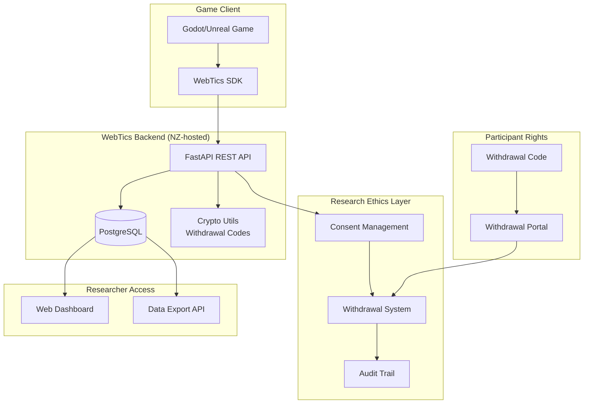
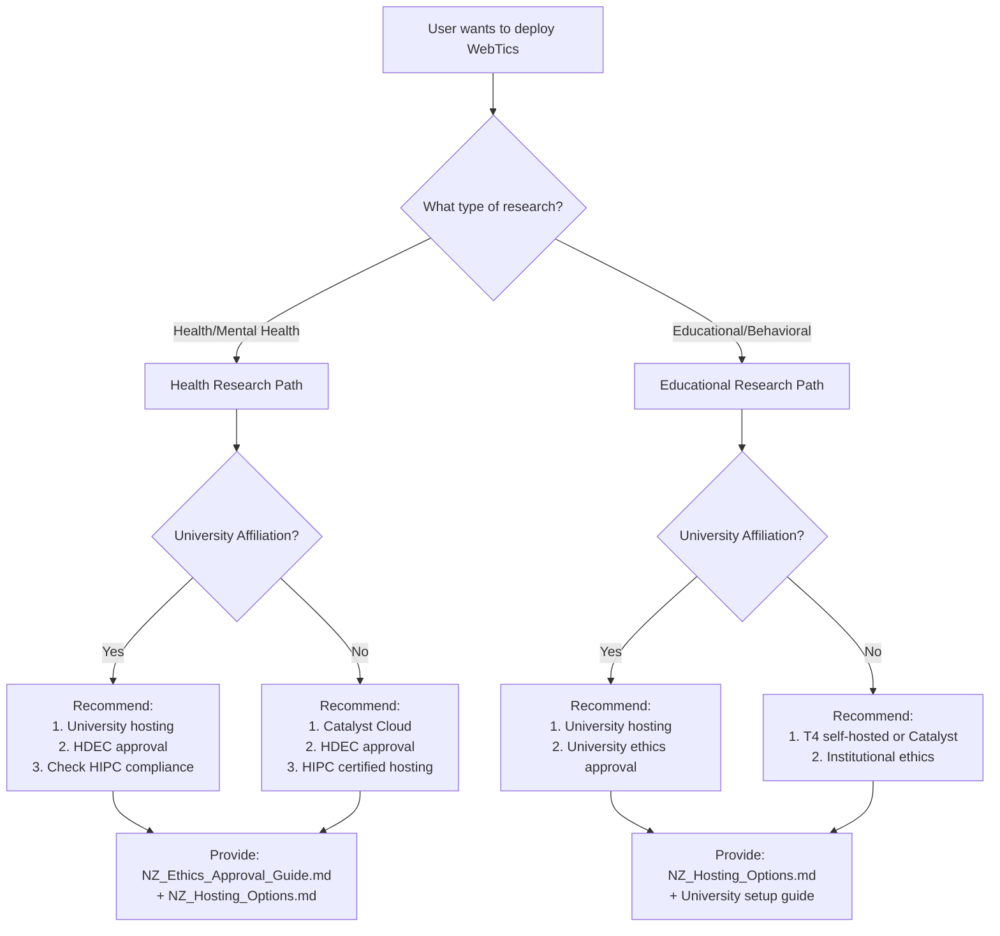
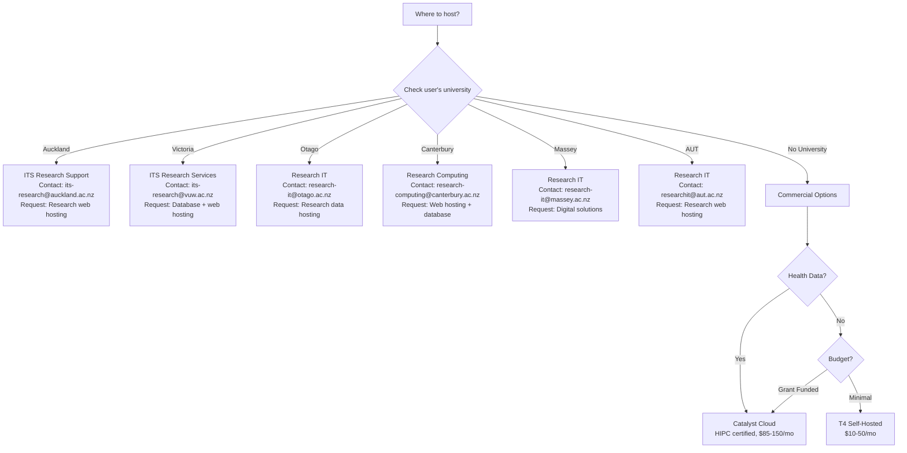
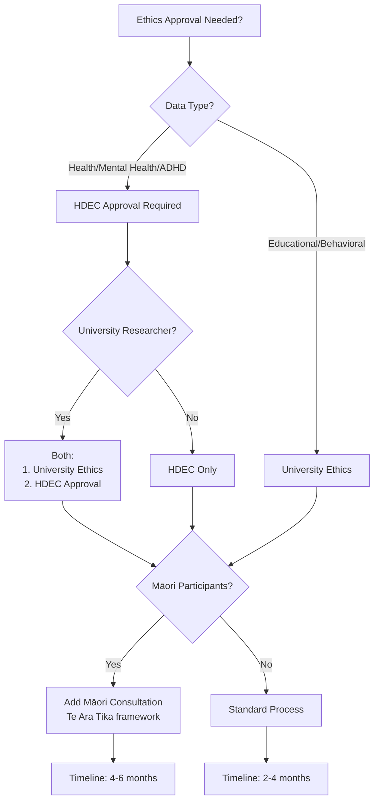

# AI Agent Guide for WebTics

**Purpose**: This document helps AI agents (like Claude, GPT, etc.) assist researchers in deploying WebTics for NZ research compliance.

## Quick Start for AI Agents

### What is WebTics?

WebTics is a self-hosted game telemetry system designed for NZ research compliance, especially health research (ADHD assessment, mental health games, therapeutic interventions).

**Key differentiator**: Built-in support for NZ Privacy Act 2020, HIPC 2020, and research ethics requirements.

### System Architecture



### Core Components

```yaml
backend:
  technology: FastAPI + PostgreSQL
  deployment: Docker Compose
  port: 8013
  location: i:\git\WebTics\backend\

sdks:
  godot:
    language: GDScript
    location: i:\git\WebTics\sdk\godot\
    integration: Autoload singleton
  unreal:
    language: C++
    location: i:\git\WebTics\sdk\unreal\
    integration: Game Instance Subsystem

dashboard:
  technology: HTML/CSS/JavaScript (no build)
  location: i:\git\WebTics\dashboard\
  access: file:// or http://localhost:8013/dashboard

documentation:
  location: i:\git\WebTics\docs\
  key_files:
    - NZ_Ethics_Approval_Guide.md
    - NZ_Hosting_Options.md
    - Research_Ethics_Privacy.md
    - Mobile_Platform_Guide.md
```

## Decision Trees for Common Requests

### Request: "Help me deploy WebTics for my study"



### Request: "Where should I host this?"

**IMPORTANT**: WebTics needs **Research IT / Digital Solutions**, NOT HPC.



**Key Point for AI Agents:**
- ❌ Don't say: "Apply for HPC cluster" or "Use NeSI"
- ✅ Do say: "Contact Research IT for web hosting" or "Request digital solutions"

### Request: "What ethics approval do I need?"



## AI Agent Response Templates

### Template 1: Deployment Assistance

```markdown
I'll help you deploy WebTics for your [research type] study.

**Recommended Hosting:**
[Use decision tree to determine: University Research IT/Catalyst/T4]

**Important**: Request **Research IT / Digital Solutions / Research Data Hosting**, NOT HPC cluster.

**Ethics Approval Needed:**
[Use decision tree: HDEC/University/Both]

**Setup Steps:**
1. [Specific to hosting choice]
2. [...]

**Documentation to Review:**
- [Link to specific guide]
- [...]

**Estimated Timeline:** [Based on hosting + ethics]

**Next Steps:**
[Specific actionable items]
```

### Template 2: Ethics Application Assistance

```markdown
For your [study type] research, you'll need:

**Ethics Committee:** [HDEC/University/Both]

**Application Requirements:**
1. Participant information sheet (template: docs/NZ_Ethics_Approval_Guide.md)
2. Consent form with withdrawal code instructions
3. Data management plan (WebTics provides this)
4. [Māori consultation if applicable]

**WebTics Documentation to Include:**
- Privacy impact assessment: docs/Research_Ethics_Privacy.md
- Security measures: backend/app/crypto_utils.py
- Data sovereignty: docs/NZ_Hosting_Options.md

**Timeline:** [Based on committee type]

**Contact:** [Specific to user's institution]
```

### Template 3: Technical Implementation

```markdown
I'll help you implement WebTics in your [Godot/Unreal] game.

**SDK Location:** sdk/[godot|unreal]/

**Integration Steps:**
1. [Specific to game engine]
2. [...]

**Research Ethics Features Needed:**
[Based on study type]
- [ ] Consent management
- [ ] Withdrawal code system
- [ ] Privacy level: [anonymous/pseudonymous/identifiable]

**Code Example:**
[Specific to game engine and study type]

**Testing:**
1. docker-compose up -d
2. [Test withdrawal process]
3. [Verify data in dashboard]
```

## Key Files and Their Purpose

```yaml
backend:
  main_api:
    file: backend/app/main.py
    purpose: Core REST API endpoints

  models:
    file: backend/app/models.py
    purpose: Basic telemetry (sessions, events)

  research_models:
    file: backend/app/models_research.py
    purpose: Ethics compliance (consents, withdrawals)

  research_api:
    file: backend/app/routers/research.py
    purpose: Consent and withdrawal endpoints

  crypto:
    file: backend/app/crypto_utils.py
    purpose: Withdrawal code generation and verification

sdks:
  godot:
    main: sdk/godot/addons/webtics/WebTics.gd
    events: sdk/godot/addons/webtics/EventTypes.gd
    readme: sdk/godot/addons/webtics/README.md

  unreal:
    subsystem: sdk/unreal/WebTics/Source/WebTics/Public/WebTicsSubsystem.h
    types: sdk/unreal/WebTics/Source/WebTics/Public/WebTicsTypes.h
    readme: sdk/unreal/WebTics/README.md

documentation:
  nz_ethics: docs/NZ_Ethics_Approval_Guide.md
  nz_hosting: docs/NZ_Hosting_Options.md
  research_privacy: docs/Research_Ethics_Privacy.md
  mobile: docs/Mobile_Platform_Guide.md
  testing: TESTING.md
  ports: PORT_MANAGEMENT.md

examples:
  minigame: minigame/reaction_test/
  dashboard: dashboard/index.html
```

## Regulation Checking Protocol

**Before assisting with deployment, AI agents should verify current regulations:**

### Search Queries to Run

```yaml
privacy_act_check:
  query: "New Zealand Privacy Act 2020 amendments [current_year]"
  frequency: every_deployment
  source: site:privacy.org.nz

hipc_check:
  query: "Health Information Privacy Code 2020 updates [current_year]"
  frequency: every_deployment
  source: site:privacy.org.nz

hdec_procedures:
  query: "HDEC operational procedures latest [current_year]"
  frequency: quarterly
  source: site:ethics.health.govt.nz

university_ethics:
  query: "[university_name] human ethics committee policy [current_year]"
  frequency: per_institution
  source: university website

maori_data_sovereignty:
  query: "Te Mana Raraunga Māori data sovereignty principles updates"
  frequency: annually
  source: site:temanararaunga.maori.nz

catalyst_cloud_hipc:
  query: "Catalyst Cloud HIPC 2020 certification status"
  frequency: annually
  source: site:catalystcloud.nz

nesi_availability:
  query: "NeSI services for [university] researchers"
  frequency: per_request
  source: site:nesi.org.nz
```

### Verification Checklist

When assisting with deployment:

```yaml
- [ ] Privacy Act 2020 still current (no major amendments)
- [ ] HIPC 2020 still current (no major amendments)
- [ ] HDEC procedures up to date
- [ ] User's university ethics policy checked
- [ ] Hosting provider still HIPC compliant (if health data)
- [ ] Māori consultation requirements unchanged
- [ ] NeSI/university HPC still available for user's institution
```

## CRITICAL: HPC vs Research Data Hosting

**AI Agents MUST understand this distinction:**

```yaml
webtics_needs:
  service: Research IT / Digital Solutions / Research Data Hosting
  purpose: Web hosting (database + API server)
  compute: Lightweight (2-4 CPU, 4-8GB RAM)
  what_to_request: "PostgreSQL database + VM for Docker web app"
  cost: FREE at universities

hpc_is_for:
  service: HPC cluster (NeSI, RAAPOI, etc.)
  purpose: Heavy computation (ML, simulations)
  compute: Many cores, large RAM
  what_to_request: "Compute allocation for analysis"
  cost: FREE but requires computational justification

when_to_mention_hpc:
  - User wants to analyze telemetry data with ML
  - User needs statistical analysis at scale
  - AFTER collecting data, separate from hosting

when_NOT_to_mention_hpc:
  - User wants to host WebTics ❌
  - User needs database hosting ❌
  - User needs web server ❌
```

**Example Incorrect Response:**
❌ "Apply for NeSI HPC access to host WebTics"
❌ "Use RAAPOI cluster for your database"
❌ "Request HPC allocation for web hosting"

**Example Correct Response:**
✅ "Contact VUW ITS Research for web hosting (not HPC)"
✅ "Request PostgreSQL database + Docker VM from Research IT"
✅ "This is research data hosting, not HPC - different service"

## Common User Requests and Responses

### Request: "I need to track ADHD assessment data"

**Analysis:**
- Data type: Health
- Requires: HDEC approval
- Privacy level: Pseudonymous (withdrawal needed)
- Hosting: University HPC (if available) or Catalyst Cloud

**Response Pattern:**
```markdown
Your ADHD assessment study requires:

1. **Ethics:** HDEC approval (health research)
   - Guide: docs/NZ_Ethics_Approval_Guide.md
   - Timeline: 2-4 months

2. **Hosting:** [Check university affiliation]
   - If VUW: Contact ITS Research Services (its-research@vuw.ac.nz)
     Request: "Research web hosting for database" (FREE)
   - If no university: Catalyst Cloud ($85-150/mo)
   - Guide: docs/NZ_Hosting_Options.md
   - ⚠️ DON'T request HPC cluster (WebTics is lightweight web hosting)

3. **Privacy Level:** Pseudonymous
   - Participants get withdrawal codes
   - Implementation: backend/app/routers/research.py

4. **SDK:** Godot or Unreal
   - Godot: sdk/godot/addons/webtics/
   - Unreal: sdk/unreal/WebTics/

Would you like help with [specific step]?
```

### Request: "How do I implement withdrawal?"

**Response Pattern:**
```markdown
WebTics withdrawal system:

**How it works:**
1. Participant consents → receives withdrawal code (WC-xxxx-xxxx)
2. Code is hashed (HMAC-SHA256), only hash stored
3. Researcher never sees the code
4. Participant can withdraw anytime via withdrawal portal
5. All data deleted permanently

**Implementation:**
[Godot example]
var consent = await WebTics.create_research_consent(
    study_id="ADHD_2026_001",
    privacy_level=PrivacyLevel.PSEUDONYMOUS
)

show_withdrawal_code_dialog(consent.withdrawal_code)

**Withdrawal Portal:**
dashboard/withdrawal.html (customize for your study)

**Technical Details:**
- Crypto: backend/app/crypto_utils.py
- API: backend/app/routers/research.py
- Documentation: docs/Research_Ethics_Privacy.md

**Security:**
- 128-bit entropy (UUID4-equivalent)
- HMAC with secret key (no rainbow tables)
- Per-record salt (no hash comparison)
- Constant-time verification (no timing attacks)
```

### Request: "What's the difference between anonymous and pseudonymous?"

**Response Pattern:**
```markdown
WebTics Privacy Levels:

1. **Anonymous**
   - No identifiers collected
   - Cannot withdraw (impossible to identify data)
   - Lowest ethical burden
   - Use for: General game analytics

2. **Pseudonymous** ⭐ RECOMMENDED
   - Random ID (e.g., P-a3f8b2c1)
   - Withdrawal code provided
   - Supports "right to be forgotten"
   - Use for: Research studies

3. **Identifiable**
   - Direct personal data (name, email)
   - Highest ethical burden
   - Avoid unless necessary
   - Use for: Longitudinal studies requiring follow-up

For NZ research: Use pseudonymous (balances privacy + ethics)

Implementation: privacy_level parameter in create_consent()
```

## Integration Patterns

### Pattern 1: Godot ADHD Assessment Game

```gdscript
extends Node

func _ready():
    # Configure WebTics
    WebTics.configure("https://webtics.vuw.ac.nz")  # Example VUW hosting

    # Show consent dialog
    var consented = await show_consent_dialog()
    if not consented:
        return

    # Create research consent
    var consent = await WebTics.create_research_consent(
        study_id="ADHD_2026_VUW_001",
        privacy_level=PrivacyLevel.PSEUDONYMOUS,
        participant_info={
            "age_range": "18-25",
            "condition": "ADHD"
        },
        ethics_protocol="HDEC-2026-123"
    )

    # Give participant withdrawal code
    show_withdrawal_code_screen(consent.withdrawal_code)

    # Start metric session
    WebTics.open_metric_session(consent.participant_id, "1.0.0")
    await WebTics.session_created

    WebTics.start_play_session()
    await WebTics.play_session_created

func log_adhd_event(response_time: float, accuracy: bool):
    WebTics.log_event(
        EventTypes.Type.ATTENTION_TASK,
        EventTypes.AssessmentSubtype.REACTION_TIME,
        0, 0, 0,
        response_time,
        {"accuracy": "correct" if accuracy else "incorrect"}
    )
```

### Pattern 2: Unreal Mental Health Game

```cpp
void ATherapeuticGameMode::BeginPlay()
{
    Super::BeginPlay();

    UWebTicsSubsystem* WebTics = GetGameInstance()->GetSubsystem<UWebTicsSubsystem>();

    WebTics->Configure("https://webtics.otago.ac.nz");

    // Consent flow (implement in Blueprint)
    // ...

    WebTics->OpenMetricSession("P-participant-id", "1.0.0");
}

void ATherapeuticPlayerController::OnTaskCompleted(float Score)
{
    UWebTicsSubsystem* WebTics = GetGameInstance()->GetSubsystem<UWebTicsSubsystem>();

    TMap<FString, FString> Data;
    Data.Add("task_type", "anxiety_exposure");
    Data.Add("difficulty", FString::FromInt(CurrentDifficulty));

    WebTics->LogEvent(
        EWebTicsEventType::TASK_COMPLETE,
        0,
        0, 0, 0,
        Score,
        Data
    );
}
```

## Port Management

**Current WebTics Port:** 8013

**Before suggesting a port for a new service, check:**
```bash
# Windows
netstat -ano | findstr LISTENING

# Available ranges: 8100-8199, 8200-8299, 9001-9099, 10000-10099
```

**Document in:** PORT_MANAGEMENT.md

## Error Handling for AI Agents

### Common Errors and Solutions

**Error:** "User asks for 'IRB approval' (US term)"
**Solution:** Clarify NZ uses HDEC (Health and Disability Ethics Committees), not IRBs

**Error:** "User wants to use AWS/Google Cloud"
**Solution:** Explain HIPC Rule 12 requires NZ hosting for health data, suggest Catalyst Cloud or university hosting

**Error:** "User doesn't know their university"
**Solution:** Ask which NZ university they're affiliated with, then provide specific IT contact from NZ_Hosting_Options.md

**Error:** "User asks about GDPR compliance"
**Solution:** Clarify NZ uses Privacy Act 2020 and HIPC 2020, WebTics supports both

**Error:** "User wants anonymous data but also withdrawal"
**Solution:** Explain paradox: anonymous = can't identify who to delete. Recommend pseudonymous instead.

## Key Constraints

```yaml
must_be_nz_hosted:
  reason: HIPC 2020 Rule 12 (data sovereignty)
  applies_to: health_data
  options: [university, catalyst_cloud, datacom, revera, t4_self_hosted]

must_not_use:
  - AWS (offshore)
  - Google Cloud (offshore)
  - Azure (offshore unless NZ region)
  - Firebase (offshore)
  - Any non-NZ provider

port_must_not_conflict:
  current_port: 8013
  reserved: [80, 443, 3000, 4200, 5000, 8000, 8080, 8888, 9000]
  available: [8100-8199, 8200-8299, 9001-9099, 10000-10099]

privacy_levels:
  - anonymous: no_withdrawal_possible
  - pseudonymous: withdrawal_supported
  - identifiable: avoid_unless_necessary
```

## Testing Checklist for AI Agents

When helping user deploy:

```yaml
pre_deployment:
  - [ ] Ethics approval obtained (HDEC or university)
  - [ ] Hosting chosen and accessible
  - [ ] Port selected (not conflicting)
  - [ ] Docker and Docker Compose installed
  - [ ] SSL certificate plan (Let's Encrypt or university)

deployment:
  - [ ] git clone WebTics repository
  - [ ] Update port in docker-compose.yml (if not 8013)
  - [ ] docker-compose up -d
  - [ ] Verify backend: curl http://localhost:8013/
  - [ ] Test database: docker-compose exec db psql -U webtics

integration:
  - [ ] SDK copied to game project
  - [ ] Configure WebTics.configure(url)
  - [ ] Implement consent flow
  - [ ] Test withdrawal code generation
  - [ ] Verify events logged to database

compliance:
  - [ ] Test withdrawal process end-to-end
  - [ ] Verify data stays in NZ (check hosting)
  - [ ] Confirm TLS/HTTPS enabled
  - [ ] Audit logs working
  - [ ] Participant information sheet created
  - [ ] Withdrawal instructions provided
```

## Quick Reference

### Commands

```bash
# Start WebTics
cd i:\git\WebTics
docker-compose up -d

# Check status
curl http://localhost:8013/

# View logs
docker-compose logs -f backend

# Database access
docker-compose exec db psql -U webtics -d webtics

# Stop WebTics
docker-compose down
```

### URLs

```yaml
backend_api: http://localhost:8013/
api_docs: http://localhost:8013/docs
dashboard: i:\git\WebTics\dashboard\index.html

# Example university hosting
vuw_example: https://webtics.vuw.ac.nz
otago_example: https://webtics.otago.ac.nz
```

### Contacts

```yaml
webtics_support: simon.mccallum@gmail.com

university_it:
  auckland: AskAuckland web form or university@auckland.ac.nz
  victoria: Service Desk web form or phone 463 5050
  otago: university@otago.ac.nz or research@otago.ac.nz
  canterbury: eResearch@canterbury.ac.nz (verified)
  massey: contact@massey.ac.nz or web form
  aut: research@aut.ac.nz or 0800 AUT ICT

commercial:
  catalyst: sales@catalystcloud.nz
```

---

**For AI Agents:**
- Use decision trees to determine recommendations
- Verify regulations before each deployment (run search queries)
- Provide specific, actionable guidance
- Reference exact file paths and code examples
- Check university affiliation early in conversation
- Clarify HDEC vs IRB terminology
- Ensure NZ hosting for health data

**Document Version:** 1.0
**Last Updated:** February 15, 2026
