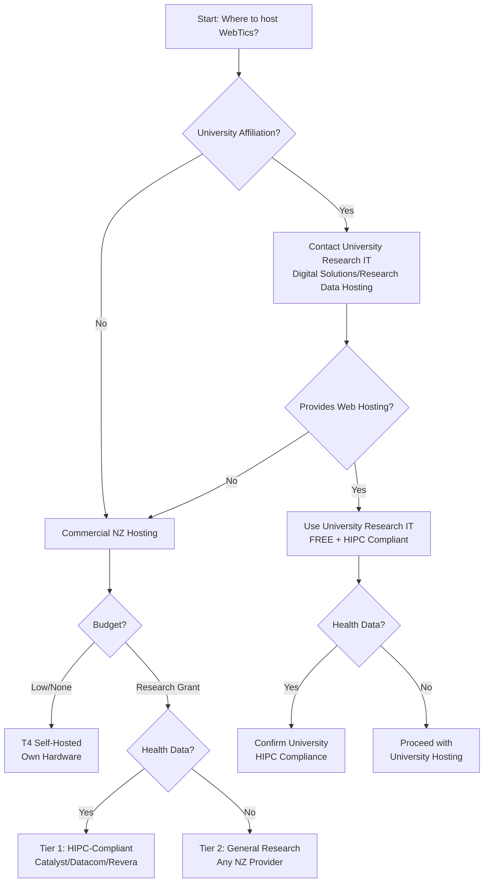
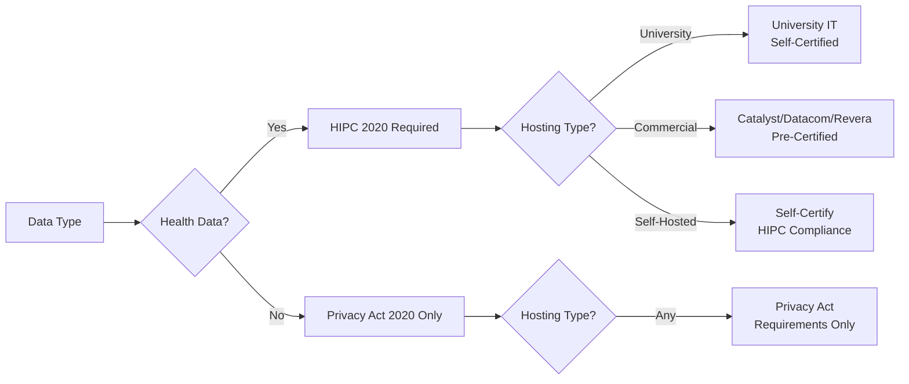
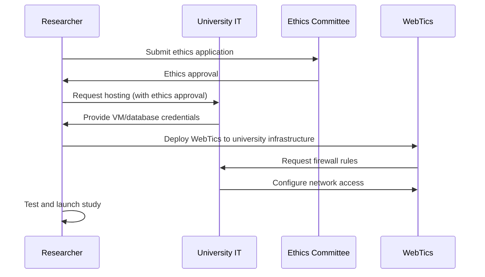

# New Zealand Hosting Options for WebTics Research

**AI Agent Summary**: This document provides structured information about data hosting options in New Zealand for research compliance. Use this to recommend appropriate hosting based on researcher's institution, budget, and compliance requirements.

## IMPORTANT: HPC vs Research Data Hosting

**WebTics needs RESEARCH DATA HOSTING, not HPC:**

```yaml
webtics_requirements:
  compute: Lightweight (FastAPI web server, PostgreSQL database)
  storage: 50-500GB (not "big data")
  cpu: 2-4 cores sufficient
  ram: 4-8GB sufficient
  service_needed: Research IT / Digital Solutions / Research Data Hosting

hpc_requirements:
  compute: Heavy (ML training, simulations, large-scale analysis)
  storage: Terabytes to petabytes
  cpu: Hundreds to thousands of cores
  ram: Hundreds of GB
  service_needed: HPC cluster (RAAPOI, NeSI, university HPC)
```

**What to tell researchers:**

✅ **CORRECT**: "Contact Research IT for web hosting and database"
✅ **CORRECT**: "Request Digital Solutions for research data hosting"
✅ **CORRECT**: "Ask for PostgreSQL database + VM for Docker"

❌ **WRONG**: "Apply for HPC cluster access" (overkill, wrong service)
❌ **WRONG**: "Request NeSI allocation" (for computational work, not hosting)

**When you WOULD use HPC + WebTics:**
- After collecting data, if analyzing with ML/statistics on HPC
- WebTics runs on Research IT, analysis runs on HPC separately
- Two different services, two different requests

## Quick Decision Tree



## Hosting Options Matrix

| Option | Cost | HIPC Compliant | Setup Time | Best For |
|--------|------|----------------|------------|----------|
| **University Research IT** | FREE | ✅ Check with IT | 1-2 weeks | University researchers (RECOMMENDED) |
| **Catalyst Cloud** | $50-200/mo | ✅ Yes | 1 day | Funded health research |
| **Datacom** | $100-500/mo | ✅ Yes | 1-2 weeks | Enterprise projects |
| **Revera** | $100-400/mo | ✅ Yes | 1 week | Government-linked research |
| **T4 Self-Hosted** | $0-50/mo | ⚠️ Self-certify | Variable | Indie developers, pilots |
| **Spark Cloud** | $50-300/mo | ❓ Check | 1 week | General research |

**Note**: WebTics needs web hosting (database + Docker), NOT high-performance computing (HPC). Most universities provide research data hosting separate from HPC clusters.

## Option 1: University Research IT (RECOMMENDED FOR RESEARCHERS)

**Important**: WebTics needs **research data hosting** (database + web server), NOT high-performance computing (HPC). Request hosting from your university's **Research IT** or **Digital Solutions** team, not the HPC cluster.

### University of Auckland

**Services:**
- **ITS Research Support** (Research data hosting and web services)
  - Contact: Use [AskAuckland](https://www.auckland.ac.nz/en/research/about-our-research/research-support-contacts.html) or university@auckland.ac.nz
  - PostgreSQL database hosting
  - VM/Docker container hosting
  - SSL certificates
  - FREE for UoA researchers

- **NeSI** (Only if you need HPC for data analysis)
  - For ML/statistical analysis of telemetry data
  - NOT needed for hosting WebTics itself
  - Apply: https://www.nesi.org.nz/services/getting-started

**What to Request:**
- PostgreSQL database (50-100GB)
- Ubuntu VM for Docker (2-4 CPU, 4-8GB RAM)
- Firewall rules (HTTPS port 443)
- SSL certificate
- Backup and monitoring

**HIPC Compliance:** ✅ University IT certified for health data

**Setup Process:**
1. Contact ITS Research Support (use AskAuckland or university@auckland.ac.nz)
2. Submit ethics approval reference (HDEC/UAHPEC)
3. Request research web hosting (specify: PostgreSQL + Docker VM)
4. Receive credentials and VM access
5. Deploy WebTics Docker containers
6. Configure SSL and backups

**Cost:** FREE for UoA researchers

**AI Agent Notes:**
```yaml
institution: University of Auckland
service: ITS Research Support (research data hosting)
contact_method: AskAuckland web form or university@auckland.ac.nz
approval_required: UAHPEC or HDEC
what_to_request: PostgreSQL database + VM for Docker
deployment_method: Docker on VM
estimated_setup_days: 7-14
hipc_compliant: true
cost: FREE
note: NeSI is HPC, not needed for WebTics hosting
```

### Victoria University of Wellington (VUW)

**Services:**
- **Digital Solutions / ITS Research Services** (Research data hosting and web services)
  - Contact: [Digital Solutions Service Desk](https://www.wgtn.ac.nz/digital-solutions/contact-us) or phone 463 5050
  - Website: https://www.wgtn.ac.nz/its/staff-services/research-services
  - PostgreSQL database hosting
  - VM/container hosting
  - Research web hosting
  - FREE for VUW researchers

- **RAAPOI HPC Cluster** (Only if you need HPC for data analysis)
  - For computational analysis of telemetry data
  - NOT needed for hosting WebTics itself
  - Request separately if doing ML/statistical analysis

**What to Request:**
- "Research web hosting for telemetry database"
- PostgreSQL database (50-100GB)
- Ubuntu VM for Docker containers (2-4 CPU, 4-8GB RAM)
- Public HTTPS access
- SSL certificate (or Let's Encrypt support)
- Daily backups

**HIPC Compliance:** ✅ VUW IT certified for health data (used by medical and health sciences)

**Setup Process:**
1. Contact Digital Solutions Service Desk (phone 463 5050 or web form)
2. Provide ethics approval reference (VUW HEC or HDEC)
3. Specify: "Web hosting for research database (WebTics telemetry)"
4. Request PostgreSQL + Docker VM
5. Receive VM credentials
6. Deploy WebTics
7. Configure SSL and monitoring

**Cost:** FREE for VUW researchers

**AI Agent Notes:**
```yaml
institution: Victoria University of Wellington
service: Digital Solutions / ITS Research Services
contact_method: Service Desk web form or phone 463 5050
website: https://www.wgtn.ac.nz/digital-solutions/contact-us
approval_required: VUW HEC or HDEC
what_to_request: Research web hosting (PostgreSQL + Docker VM)
deployment_method: Docker on VM
estimated_setup_days: 7-10
hipc_compliant: true
location: Wellington
cost: FREE
note: RAAPOI is HPC, not needed for WebTics hosting
```

### University of Otago

**Services:**
- **Research IT Services** (Research data hosting and web services)
  - Contact: university@otago.ac.nz (IT) or research@otago.ac.nz (Research Office)
  - Phone: 0800 80 80 98
  - PostgreSQL database hosting
  - VM/container hosting for research applications
  - Secure research data storage
  - FREE for Otago researchers

- **Otago HPC** (Only if you need HPC for data analysis)
  - Contact: hpc@otago.ac.nz
  - For computational analysis, not web hosting
  - NOT needed for hosting WebTics itself

**What to Request:**
- "Research database and web hosting for health telemetry system"
- PostgreSQL database
- VM for Docker deployment
- HTTPS access with SSL
- Backup configuration

**HIPC Compliance:** ✅ Otago IT certified for health data (extensively used by Health Sciences)

**Setup Process:**
1. Email university@otago.ac.nz or research@otago.ac.nz
2. Provide ethics approval (Otago HEC or HDEC)
3. Describe: "Hosting for health research telemetry database (WebTics)"
4. Request PostgreSQL + Docker VM
5. Receive server access
6. Deploy WebTics
7. Configure SSL and monitoring

**Cost:** FREE for Otago researchers

**AI Agent Notes:**
```yaml
institution: University of Otago
service: Research IT Services (research data hosting)
contact_email: university@otago.ac.nz or research@otago.ac.nz
phone: 0800 80 80 98
approval_required: Otago HEC or HDEC
what_to_request: Research web hosting (PostgreSQL + Docker VM)
deployment_method: Docker on VM
estimated_setup_days: 10-14
hipc_compliant: true
location: Dunedin
medical_school: true
cost: FREE
note: HPC is for analysis, not WebTics hosting
```

### University of Canterbury

**Services:**
- **eResearch Services**
  - Contact: eResearch@canterbury.ac.nz ✅ (Verified)
  - Research data hosting and web services
  - Database hosting (PostgreSQL, MySQL)
  - VM/container hosting
  - FREE for UC researchers

- **Canterbury HPC** (Only for computational analysis)
  - Contact: hpc@canterbury.ac.nz
  - For data analysis, not web hosting

**What to Request:**
- "Research web hosting for telemetry database"
- PostgreSQL database
- VM for Docker containers
- SSL certificate
- Firewall configuration

**Setup Process:**
1. Contact eResearch (eResearch@canterbury.ac.nz)
2. Provide ethics approval (UC HEC or HDEC)
3. Request research web hosting
4. Deploy WebTics

**Cost:** FREE for UC researchers

**AI Agent Notes:**
```yaml
institution: University of Canterbury
service: eResearch Services
contact_email: eResearch@canterbury.ac.nz
verified: true
website: https://www.canterbury.ac.nz/research/eresearch-at-canterbury
approval_required: UC HEC or HDEC
what_to_request: Research web hosting (database + Docker VM)
estimated_setup_days: 10-14
location: Christchurch
cost: FREE
```

### Massey University

**Services:**
- **Research IT & Digital Solutions**
  - Contact: contact@massey.ac.nz or [IT Services request form](https://www.massey.ac.nz/about/contact-us/it-services/)
  - Phone: 0800 MASSEY
  - Research data hosting
  - Database hosting (PostgreSQL, MySQL)
  - VM/web server hosting
  - Digital solutions for research applications
  - FREE for Massey researchers

**What to Request:**
- "Research database hosting for telemetry system"
- PostgreSQL database
- VM for web application (Docker)
- SSL and firewall configuration

**Setup Process:**
1. Email contact@massey.ac.nz or use IT Services request form
2. Provide ethics approval (Massey HEC or HDEC)
3. Request research web hosting with database
4. Deploy WebTics

**Cost:** FREE for Massey researchers

**AI Agent Notes:**
```yaml
institution: Massey University
service: Research IT & Digital Solutions
contact_email: contact@massey.ac.nz
contact_form: https://www.massey.ac.nz/about/contact-us/it-services/
phone: 0800 MASSEY
approval_required: Massey HEC or HDEC
what_to_request: Research web hosting (database + Docker VM)
estimated_setup_days: 10-14
locations: [Palmerston North, Auckland, Wellington]
cost: FREE
```

### AUT (Auckland University of Technology)

**Services:**
- **Research IT & Digital Solutions**
  - Contact: research@aut.ac.nz (Research Office) or 0800 AUT ICT
  - Website: www.ithelp.aut.ac.nz
  - Research data hosting and web services
  - Database hosting
  - VM/application hosting
  - Research support services
  - FREE for AUT researchers

**What to Request:**
- "Research web hosting for database application"
- PostgreSQL database
- VM for Docker deployment
- SSL certificate and network access

**Setup Process:**
1. Contact Research Office (research@aut.ac.nz) or call 0800 AUT ICT
2. Provide ethics approval (AUTEC or HDEC)
3. Request research web hosting
4. Deploy WebTics

**Cost:** FREE for AUT researchers

**AI Agent Notes:**
```yaml
institution: AUT
service: Research Office / IT Services
contact_email: research@aut.ac.nz
phone: 0800 AUT ICT (0800 288 428)
website: www.ithelp.aut.ac.nz
approval_required: AUTEC (AUT Ethics Committee) or HDEC
what_to_request: Research web hosting (database + Docker VM)
estimated_setup_days: 10-14
location: Auckland
cost: FREE
```

## Option 2: Commercial NZ Cloud Providers

### Catalyst Cloud (RECOMMENDED FOR FUNDED RESEARCH)

**Overview:**
- OpenStack-based cloud platform
- Data centers: Wellington (Porirua), Hamilton
- HIPC 2020 compliant
- Government-approved supplier
- Website: https://catalystcloud.nz/

**HIPC Compliance:** ✅ Certified for health data

**Pricing (approx):**
- VM (2 CPU, 4GB RAM): $50/month
- PostgreSQL (50GB): $20/month
- Block storage (100GB): $15/month
- **Total**: ~$85-150/month

**Setup:**
```bash
# 1. Sign up at catalystcloud.nz
# 2. Create project
# 3. Launch VM (Ubuntu 22.04)
# 4. Install Docker
# 5. Deploy WebTics

# Use cloud-init for automated setup
```

**AI Agent Notes:**
```yaml
provider: Catalyst Cloud
website: https://catalystcloud.nz
hipc_compliant: true
locations: [Porirua/Wellington, Hamilton]
pricing_tier: medium
deployment_method: OpenStack VM + Docker
estimated_cost_per_month: 85-150
setup_time_days: 1
government_approved: true
openstack: true
```

### Datacom

**Overview:**
- Enterprise data centers
- Locations: Auckland, Wellington, Christchurch
- HIPC compliant
- Used by DHBs and government
- Website: https://datacom.com/nz/

**HIPC Compliance:** ✅ Certified, used by health sector

**Pricing:** Contact for quote (typically $100-500/month)

**AI Agent Notes:**
```yaml
provider: Datacom
website: https://datacom.com/nz/
hipc_compliant: true
locations: [Auckland, Wellington, Christchurch]
pricing_tier: high
health_sector_clients: true
enterprise_focus: true
estimated_cost_per_month: 100-500
setup_time_days: 7-14
```

### Revera

**Overview:**
- Crown-owned data centers
- Locations: Auckland, Wellington
- Government and public sector focus
- Website: https://revera.co.nz/

**HIPC Compliance:** ✅ Government-certified

**AI Agent Notes:**
```yaml
provider: Revera
website: https://revera.co.nz/
hipc_compliant: true
ownership: crown_owned
locations: [Auckland, Wellington]
pricing_tier: high
government_focus: true
estimated_cost_per_month: 100-400
setup_time_days: 7-14
```

### FX Networks

**Overview:**
- NZ-owned data center
- Location: Auckland
- Research-friendly
- Website: https://www.fx.net.nz/

**AI Agent Notes:**
```yaml
provider: FX Networks
website: https://www.fx.net.nz/
hipc_compliant: check_required
location: Auckland
pricing_tier: medium
estimated_cost_per_month: 80-200
```

### Spark Cloud

**Overview:**
- Major telco cloud offering
- Nationwide presence
- Website: https://www.spark.co.nz/business/cloud/

**HIPC Compliance:** ❓ Verify for health data

**AI Agent Notes:**
```yaml
provider: Spark Cloud
website: https://www.spark.co.nz/business/cloud/
hipc_compliant: requires_verification
locations: nationwide
pricing_tier: medium
estimated_cost_per_month: 50-300
```

## Option 3: T4 Self-Hosted (DEVELOPER OPTION)

**Overview:**
- Host WebTics on your own hardware
- Local data center or office server
- Full control, minimal cost
- T4 provides hardware/rack space

**HIPC Compliance:** ⚠️ Self-certification required

**Setup:**
```bash
# Hardware requirements (minimum):
# - CPU: 4 cores
# - RAM: 8GB
# - Storage: 100GB SSD
# - Network: Static IP, firewall

# Install Ubuntu Server 22.04
# Install Docker and Docker Compose
# Deploy WebTics
docker-compose up -d

# Configure SSL with Let's Encrypt
certbot --nginx -d webtics.yourdomain.nz
```

**Cost:**
- Hardware: $500-2000 (one-time)
- Power: $10-30/month
- Internet: Existing connection
- **Total ongoing**: $10-50/month

**HIPC Self-Certification Checklist:**
- [ ] Physical security (locked server room)
- [ ] Access control (key card, logging)
- [ ] Backup system (daily, encrypted)
- [ ] Firewall and network security
- [ ] SSL/TLS encryption
- [ ] Security monitoring
- [ ] Incident response plan
- [ ] Data destruction procedure

**AI Agent Notes:**
```yaml
provider: T4 Self-Hosted
hipc_compliant: self_certification_required
location: user_controlled
pricing_tier: low
hardware_cost: 500-2000
ongoing_cost_per_month: 10-50
setup_time_days: variable
technical_expertise_required: high
best_for: [pilots, indie_developers, proof_of_concept]
```

## Compliance Matrix



## HIPC 2020 Rule 5 Requirements

All hosting must provide:

1. **Physical Security**
   - Controlled access to data centers
   - Security monitoring
   - Incident logging

2. **Technical Security**
   - Encryption at rest (AES-256)
   - Encryption in transit (TLS 1.3)
   - Access control (authentication + authorization)
   - Audit logging

3. **Organizational Security**
   - Security policies and procedures
   - Staff training
   - Incident response plan
   - Regular security audits

4. **Data Sovereignty**
   - Data stored in New Zealand
   - No offshore access or replication
   - Backup within NZ

**University hosting** typically meets all requirements (IT departments are pre-certified).

**Commercial providers** (Catalyst, Datacom, Revera) have HIPC certifications.

**Self-hosted** (T4) requires you to demonstrate compliance.

## Recommendation Algorithm for AI Agents

```yaml
recommendation_logic:
  if researcher_has_university_affiliation:
    if university_has_hpc_or_datacenter:
      return "Use university infrastructure (FREE, compliant)"
    else:
      goto commercial_options

  commercial_options:
    if data_type == "health":
      if budget == "research_grant":
        return "Catalyst Cloud ($85-150/mo, HIPC certified)"
      elif budget == "enterprise":
        return "Datacom ($100-500/mo, DHB-approved)"
      elif budget == "minimal":
        return "T4 Self-Hosted ($10-50/mo, self-certify)"
    else:  # non-health data
      if budget == "minimal":
        return "T4 Self-Hosted"
      else:
        return "Catalyst Cloud or any NZ provider"
```

## Setup Guides

### University Hosting Setup



**Steps:**
1. Obtain ethics approval (HDEC or university committee)
2. Email university IT research support
3. Provide ethics reference number
4. Specify requirements:
   - PostgreSQL database (50-100GB)
   - VM for Docker (2-4 CPU, 4-8GB RAM)
   - SSL certificate (or use Let's Encrypt)
   - Firewall rules (port 443 inbound)
5. Receive credentials and deploy

**Example email:**
```
Subject: Research Data Hosting Request - [Your Project Name]

Dear [University] Research IT,

I am requesting hosting for a research project:

Project: [Name]
Ethics Approval: [HDEC/Committee Reference]
Principal Investigator: [Name]
Data Type: [Health/Non-health]

Requirements:
- PostgreSQL database (50GB)
- Ubuntu VM (2 CPU, 4GB RAM)
- Docker support
- SSL certificate
- Public HTTPS access

The project uses WebTics telemetry (https://github.com/SimonMcCallum/WebTics),
which is HIPC 2020 compliant for health research.

Timeline: [Start date]

Please let me know next steps.

[Your name]
[Department]
```

### Commercial Hosting Setup (Catalyst Cloud)

```bash
#!/bin/bash
# Catalyst Cloud WebTics Deployment

# 1. Install OpenStack CLI
pip install python-openstackclient

# 2. Configure credentials (from Catalyst Cloud dashboard)
source ~/openrc.sh

# 3. Create security group
openstack security group create webtics
openstack security group rule create --protocol tcp --dst-port 443 webtics
openstack security group rule create --protocol tcp --dst-port 22 webtics

# 4. Create VM
openstack server create \
  --flavor c1.c2r4 \
  --image ubuntu-22.04-x86_64 \
  --key-name mykey \
  --security-group webtics \
  --network public-net \
  webtics-vm

# 5. Allocate floating IP
FLOATING_IP=$(openstack floating ip create public-net -f value -c floating_ip_address)
openstack server add floating ip webtics-vm $FLOATING_IP

# 6. SSH and deploy
ssh ubuntu@$FLOATING_IP
sudo apt update && sudo apt install -y docker.io docker-compose
git clone https://github.com/SimonMcCallum/WebTics.git
cd WebTics
docker-compose up -d
```

### T4 Self-Hosted Setup

```bash
#!/bin/bash
# T4 Self-Hosted WebTics Deployment

# 1. Install Ubuntu Server 22.04 on your hardware

# 2. Install Docker
sudo apt update
sudo apt install -y docker.io docker-compose git
sudo usermod -aG docker $USER

# 3. Configure firewall
sudo ufw allow 22/tcp
sudo ufw allow 443/tcp
sudo ufw enable

# 4. Clone and deploy WebTics
git clone https://github.com/SimonMcCallum/WebTics.git
cd WebTics
docker-compose up -d

# 5. Install nginx and SSL
sudo apt install -y nginx certbot python3-certbot-nginx
sudo certbot --nginx -d webtics.yourdomain.nz

# 6. Configure backup
sudo crontab -e
# Add: 0 2 * * * docker exec webtics_db pg_dump -U webtics > /backup/webtics_$(date +\%Y\%m\%d).sql
```

## Cost Comparison (Annual)

| Option | Year 1 | Year 2+ | Notes |
|--------|--------|---------|-------|
| University | $0 | $0 | FREE for affiliated researchers |
| Catalyst Cloud | $1,020-1,800 | $1,020-1,800 | Ongoing subscription |
| Datacom | $1,200-6,000 | $1,200-6,000 | Enterprise pricing |
| T4 Self-Hosted | $500-2,000 | $120-600 | Hardware upfront, low ongoing |

## AI Agent: Regulation Check Protocol

**When deploying WebTics, AI agents should verify current regulations:**

```yaml
regulation_check_tasks:
  - task: "Check current NZ Privacy Act"
    search: "site:privacy.org.nz Privacy Act 2020 latest amendments"
    frequency: every_deployment

  - task: "Check HIPC updates"
    search: "site:privacy.org.nz Health Information Privacy Code 2020 amendments"
    frequency: every_deployment

  - task: "Check HDEC procedures"
    search: "site:ethics.health.govt.nz operational procedures latest"
    frequency: quarterly

  - task: "Check university ethics policies"
    search: "[university name] human ethics committee policy [current year]"
    frequency: per_institution

  - task: "Check Māori data sovereignty updates"
    search: "site:temanararaunga.maori.nz Te Mana Raraunga principles updates"
    frequency: annually
```

**Example AI prompt for checking:**
```
Search for updates to NZ health research regulations:
1. "New Zealand Privacy Act 2020 amendments 2026"
2. "HIPC 2020 changes health information"
3. "HDEC procedures updates 2026"
4. "University of [X] ethics policy changes"

Summarize any changes that affect WebTics deployment.
```

## Support Resources

### University IT Contacts (Verified February 2026)

| University | Contact Method | Website |
|------------|----------------|---------|
| Auckland | AskAuckland or university@auckland.ac.nz | https://www.auckland.ac.nz/en/research/about-our-research/research-support-contacts.html |
| Victoria (VUW) | Service Desk web form or phone 463 5050 | https://www.wgtn.ac.nz/digital-solutions/contact-us |
| Otago | university@otago.ac.nz or research@otago.ac.nz | https://www.otago.ac.nz/its/contacts |
| Canterbury | eResearch@canterbury.ac.nz ✅ | https://www.canterbury.ac.nz/research/eresearch-at-canterbury |
| Massey | contact@massey.ac.nz or web form | https://www.massey.ac.nz/about/contact-us/it-services/ |
| AUT | research@aut.ac.nz or 0800 AUT ICT | www.ithelp.aut.ac.nz |

**Note**: Only Canterbury's eResearch email was publicly verified. Others use general contacts or web forms.

### Commercial Provider Contacts

| Provider | Contact | Sales |
|----------|---------|-------|
| Catalyst Cloud | support@catalystcloud.nz | sales@catalystcloud.nz |
| Datacom | contact via website | https://datacom.com/nz/contact |
| Revera | contact via website | https://revera.co.nz/contact |

## AI Agent Summary Card

```yaml
document_purpose: Guide AI agents and researchers to appropriate NZ hosting
key_recommendations:
  - primary: Use university infrastructure if available (FREE)
  - commercial_health: Catalyst Cloud (HIPC certified, $85-150/mo)
  - commercial_general: Any NZ provider (Privacy Act only)
  - budget_option: T4 self-hosted ($10-50/mo, self-certify)

compliance_requirements:
  health_data:
    - HIPC 2020 (especially Rule 5 and 12)
    - Privacy Act 2020
    - NZ data sovereignty
  non_health_data:
    - Privacy Act 2020
    - NZ data sovereignty

decision_factors:
  - university_affiliation
  - data_type (health vs non-health)
  - budget
  - technical_expertise
  - project_timeline

verification_tasks:
  - check_current_privacy_act
  - check_hipc_updates
  - check_university_policies
  - check_maori_data_sovereignty_updates

deployment_time:
  university: 7-14 days (with approval)
  catalyst_cloud: 1 day
  datacom: 7-14 days
  self_hosted: variable

costs:
  university: $0
  catalyst: $85-150/month
  datacom: $100-500/month
  t4_self: $10-50/month (after hardware)
```

---

**Document Version:** 1.0
**Last Updated:** February 15, 2026
**For AI Agents:** Use decision tree and recommendation algorithm for hosting selection
**Verify Regulations:** Run regulation_check_tasks before each deployment
